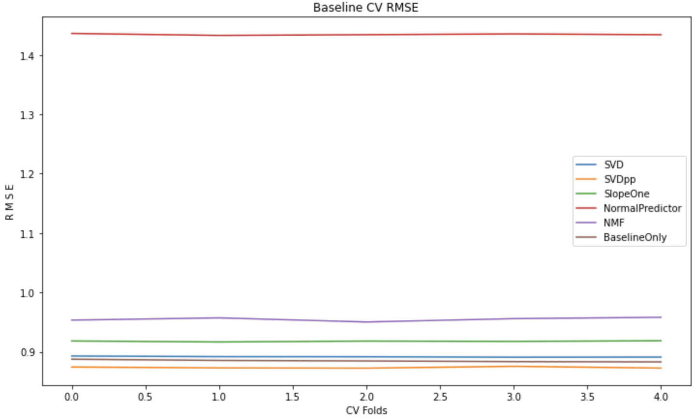
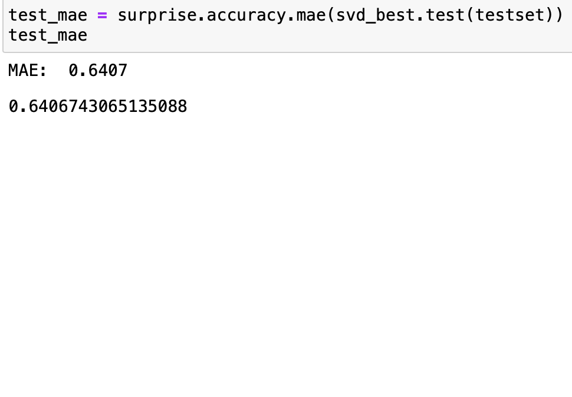
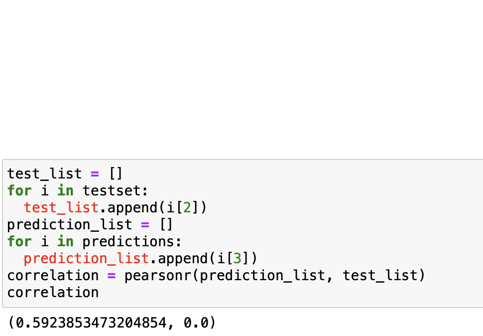
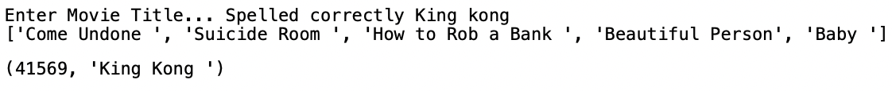
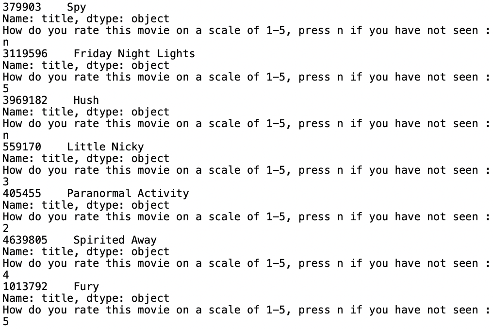
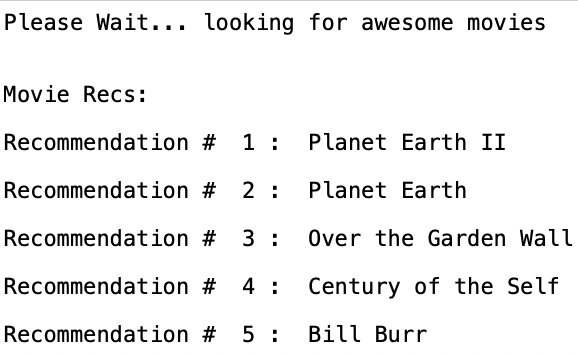

# Movie Recommendation System

By: Austin Boring

## Summary
The Goal here is to create a movie recommendation system, outputting recommendations based on two different inputs. The first input being a string movie title, outputting most similar movies based on user rating data. The second input being a series of movies rated by the user, to output most similar movies based on this users ratings paired with all other user ratings. 

## The Data 
Data was pulled from the grouplens movielens data base, a non-commercial movie recommendation platform run by the University of Minnesota. 

## Modeling 

6 Different Models were trained and evaluated with SVD++ outperforming all others

## Metrics

The tuned model was able to achieve a Mean Absolute Error of 0.64  
 

 

with a pearson correlation of 0.59 between predicted and actual ratings

## Recommendation Examples
Example using a movie title input
 

 
And an example using user inputted ratings
 
Ratings:
 

Recommendations:
 

